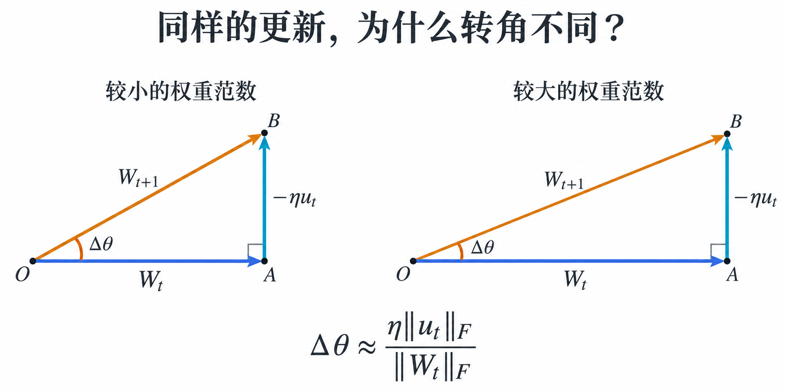
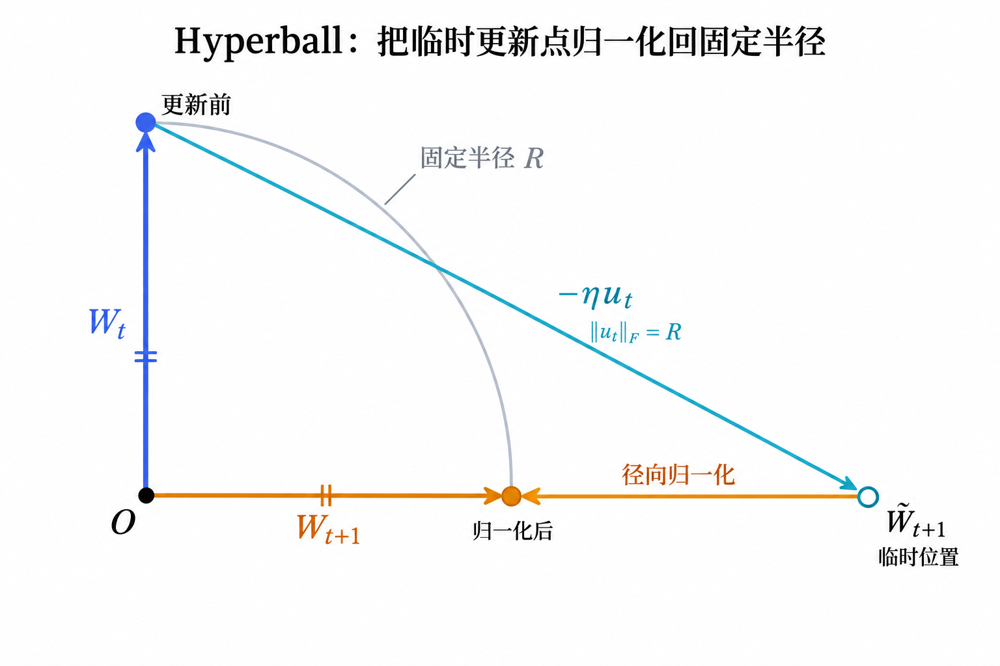

# Hyperball：从 Weight Decay 到显式权重范数约束

现代 Transformer 中，经常会用到线性层和归一化层，例如 RMSNorm、LayerNorm。当权重整体缩放带来的影响能被后续归一化抵消时，就会出现一个重要现象：**权重的整体尺度对模型输出影响很小，真正影响输出的是权重的方向。**

但尺度对输出不重要，并不意味着它对训练也不重要：**同样大小的更新，在不同的权重尺度下，会带来不同幅度的方向变化。** 这正是理解权重衰减（Weight Decay）、有效学习率（Effective Learning Rate，ELR）和 Hyperball 之间关系的关键。

下面先把权重拆成长度和方向，再借助两张几何图，理解权重范数如何影响更新，以及 Hyperball 如何显式控制它。

## 尺度不变性：为什么可以把权重的长度和方向分开看？

考虑线性层 \(Y=XW\)。把权重整体放大 \(c\) 倍，输出也会放大 \(c\) 倍：

$$
W\rightarrow cW,
\qquad
Y'=X(cW)=cXW=cY.
$$

RMSNorm 会用激活的均方根（RMS）对激活进行归一化。忽略数值稳定项时，由于

$$
\operatorname{RMS}(cY)=|c|\operatorname{RMS}(Y),
$$

当 \(c>0\) 时，就有：

$$
\operatorname{RMSNorm}(cY)
=\frac{cY}{\operatorname{RMS}(cY)}
=\frac{cY}{c\operatorname{RMS}(Y)}
=\operatorname{RMSNorm}(Y).
$$

也就是说，权重缩放先改变了激活的整体幅值，RMSNorm 又把这一变化抵消了。如果这种缩放不再通过其他路径影响输出，就可以近似认为损失函数满足：

$$
\boxed{L(cW)\approx L(W)}.
$$

这就是**尺度不变性**。下面的分析针对满足这一条件或近似条件的权重。

为了分别讨论尺度和方向，把权重矩阵写成：

$$
W_t=R_t\hat W_t,
\qquad
R_t=\|W_t\|_F,
\qquad
\hat W_t=\frac{W_t}{\|W_t\|_F}.
$$

这里，\(R_t\) 是权重范数（Weight Norm），表示权重的“长度”；\(\hat W_t\) 表示权重方向。\(\|W_t\|_F\) 是 Frobenius 范数，即把矩阵所有元素的平方相加后开方。

在理想的尺度不变情形下，损失对 \(R_t\) 不敏感，优化主要通过改变方向 \(\hat W_t\) 来降低损失。

## 为什么尺度不变会使梯度沿切向？

把 \(W\) 看成从原点出发的向量：沿着 \(W\) 缩放是**径向**变化，与 \(W\) 垂直则是**切向**变化。如果严格满足 \(L(cW)=L(W)\)，沿径向缩放就不会改变损失。

对 \(c\) 在 \(c=1\) 处求导，得到：

$$
\left.\frac{\mathrm d}{\mathrm dc}L(cW)\right|_{c=1}
=\langle \nabla_WL(W),W\rangle_F
=0,
$$

因此：

$$
\boxed{\nabla_WL(W)\perp W}.
$$

其中，\(\langle\cdot,\cdot\rangle_F\) 表示矩阵对应元素乘积之和。内积为零，说明梯度与权重垂直，即沿着以原点为球心、以权重范数为半径的球面的切向。

不过，优化器使用的更新方向 \(u_t\) 可能经过动量、预条件等处理，不一定仍与 \(W_t\) 垂直。因此，后文采用

$$
\langle W_t,u_t\rangle_F\approx0
$$

作为分析近似，并不要求它在实际训练的每一步都严格成立。

## 权重范数如何影响有效学习率？

先考虑更新：

$$
W_{t+1}=W_t-\eta u_t.
$$

其中，\(\eta\) 是学习率（LR），实际更新的大小是 \(\eta\|u_t\|_F\)。图 1 把切向更新画成首尾相接的向量：蓝色是更新前的权重，青色是实际更新，橙色是更新后的权重。两侧使用相同尺度，青色箭头等长。

*图 1：只改变蓝色向量的长度，比较原点处的转角。图中角度放大示意，便于辨认几何关系。*

看原点处的夹角：蓝色半径越长，同样的青色更新带来的转角越小。在切向更新 \(u_t\perp W_t\) 下，如果单步更新远小于权重范数：

$$
\eta\|u_t\|_F\ll\|W_t\|_F,
$$

那么权重方向的旋转角度近似为：

$$
\Delta\theta
\approx
\frac{\eta\|u_t\|_F}{\|W_t\|_F}.
$$

对于尺度不变的权重，方向变化才是影响模型的关键。因此，本文用这个角步长衡量有效学习率：

$$
\boxed{
\eta_{\mathrm{eff}}
\sim
\frac{\eta\|u_t\|_F}{\|W_t\|_F}
}.
$$

**学习率决定更新的绝对大小，而权重范数决定同样的更新能让方向转动多少。**

图 1 还呈现了切向更新的另一个作用：橙色斜边比蓝色直角边更长，也就是更新后的权重范数更大。由勾股关系可得：

$$
\|W_{t+1}\|_F^2
=\|W_t\|_F^2+\eta^2\|u_t\|_F^2.
$$

因此，如果没有径向约束，连续的切向更新会逐渐推大权重范数。这又会压低后续更新的角步长，相当于给 ELR 叠加了一层隐式衰减。

## Weight Decay 如何通过权重范数调节 ELR？

解耦权重衰减（Decoupled Weight Decay）的更新为：

$$
W_{t+1}=(1-\eta\lambda)W_t-\eta u_t,
$$

其中，\(\lambda\) 是衰减系数。这个更新包含两种相反的作用：

- \((1-\eta\lambda)W_t\) 沿径向收缩权重范数；
- \(-\eta u_t\) 在切向近似下，通过前面的几何关系增大权重范数。

沿用 \(R_t=\|W_t\|_F\)，并记 \(U_t=\|u_t\|_F\)。对更新式取范数平方：

$$
\begin{aligned}
R_{t+1}^2
&=\|(1-\eta\lambda)W_t-\eta u_t\|_F^2\\
&=(1-\eta\lambda)^2R_t^2
-2\eta(1-\eta\lambda)\langle W_t,u_t\rangle_F
+\eta^2U_t^2\\
&\approx(1-\eta\lambda)^2R_t^2+\eta^2U_t^2.
\end{aligned}
$$

最后一步使用了切向近似，忽略内积项。再利用 \(\eta\lambda\ll1\) 时的近似 \((1-\eta\lambda)^2\approx1-2\eta\lambda\)，得到：

$$
\boxed{
R_{t+1}^2-R_t^2
\approx
-2\eta\lambda R_t^2+\eta^2U_t^2
}.
$$

右侧第一项是 Weight Decay 带来的收缩，第二项是切向更新带来的范数增长。

如果学习率和衰减系数保持不变，并把 \(U_t\) 近似为稳定尺度 \(U\)，那么稳态下范数不再变化，即 \(R_{t+1}^2-R_t^2\approx0\)。此时：

$$
2\eta\lambda R_*^2\approx\eta^2U^2,
\qquad
R_*\approx U\sqrt{\frac{\eta}{2\lambda}}
\propto U\sqrt{\frac{\eta}{\lambda}}.
$$

将这个稳态半径代回 ELR，得到：

$$
\boxed{
\eta_{\mathrm{eff}}
\sim\frac{\eta U}{R_*}
\propto\sqrt{\eta\lambda}
}.
$$

因此，在这个理想化稳态模型中，Weight Decay 的作用可以理解为：

$$
\boxed{
\text{Weight Decay}
\rightarrow\text{控制权重范数}
\rightarrow\text{调节 ELR}
}.
$$

对于尺度不变的权重，Weight Decay 除了约束参数模长，还有一个优化上的意义：**通过控制半径，间接调节每一步权重方向转动的幅度。**

## Hyperball：让 LR 更直接地控制 ELR

在上面的稳态近似中，传统 Weight Decay 下的关系是 \(\eta_{\mathrm{eff}}\propto\sqrt{\eta\lambda}\)。LR 与 ELR 并不是简单的线性关系，因为改变 LR 不仅会改变更新大小，还会改变权重范数的稳态尺度。

Hyperball 的核心思路是：**显式约束权重范数，去掉半径变化对 ELR 的影响。** 它先统一更新尺度，再把每次更新后的权重沿径向归一化回固定半径。下面沿用本文的简化记号，\(u_t\) 表示归一化后的更新：

$$
\|W_t\|_F=R,
\qquad
\|u_t\|_F=R.
$$

图 2 展示这两个步骤：青色箭头先把权重带到临时位置 \(\widetilde W_{t+1}\)，橙色短箭头再把它沿原点与临时位置的连线缩放回圆上，得到最终的 \(W_{t+1}\)。

*图 2：圆弧表示固定范数约束，更新前、后的权重都在边界上。图中只示意归一化步骤，未按切向、小步长情形绘制；径向归一化保留临时位置的方向。*

回看图 1，半径会随更新增大；图 2 则在每一步把半径恢复为 \(R\)。同时，更新尺度也固定为 \(R\)，因此它们在 ELR 的比值中抵消。

在前面的切向、小步长近似下：

$$
\eta_{\mathrm{eff}}
\sim\frac{\eta\|u_t\|_F}{\|W_t\|_F}
=\frac{\eta R}{R}
=\eta.
$$

于是，LR 与 ELR 之间变成近似线性关系：

$$
\boxed{\eta_{\mathrm{eff}}\propto\eta}.
$$

两者的区别在于：**Weight Decay 通过收缩权重来间接控制角步长；Hyperball 固定权重范数，并统一更新尺度，让 LR 更直接地控制角步长。**

## 从隐式学习率调度到显式学习率调度

把这一关系放到整个训练过程中看：如果没有显式固定权重范数，每一步实际生效的 ELR 为

$$
\eta_{\mathrm{eff},t}
\sim\frac{\eta_t\|u_t\|_F}{\|W_t\|_F}.
$$

即使已经设定了学习率调度 \(\eta_t\)，权重范数的变化仍会影响 ELR。换句话说，**权重范数在额外进行一次隐式调度。**

而在上述 Hyperball 模型中，权重范数固定，更新尺度也经过统一归一化，因此：

$$
\eta_{\mathrm{eff},t}\propto\eta_t.
$$

这时，外部设置的学习率调度，就能更直接地对应模型实际经历的方向更新幅度。

从 ELR 的角度看，Hyperball 去掉了权重范数这个动态中间变量，使 \(\eta_t\rightarrow\eta_{\mathrm{eff},t}\) 的映射更直接，也让学习率调度更容易理解和控制。

## 总结

- **尺度不变性让长度和方向可以分开讨论。** 当权重整体缩放 \(W\rightarrow cW\) 对损失影响很小时，优化主要通过改变权重方向来起作用。
- **权重范数影响角步长。** 在切向、小步长近似下，\(\Delta\theta\approx\eta\|u_t\|_F/\|W_t\|_F\)。同样大小的更新，权重范数越大，ELR 越小。
- **Weight Decay 和 Hyperball 的区别在于控制方式。** Weight Decay 通过收缩权重范数间接调节 ELR；Hyperball 在上述理想化模型中固定权重范数、统一更新尺度，使 LR 与 ELR 近似成正比。

*图 1 依据本文的切向更新近似绘制；图 2 的 Hyperball 归一化步骤参照 Wen 等人的原论文 [Fantastic Pretraining Optimizers and Where to Find Them II: Hyperball Optimization，第 2 节](https://arxiv.org/html/2606.16899v1#S2)。*
