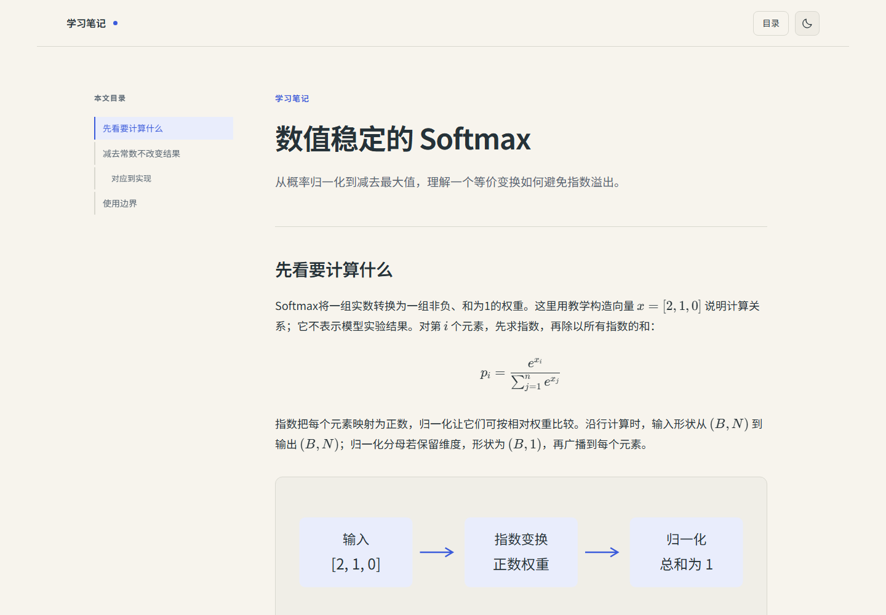
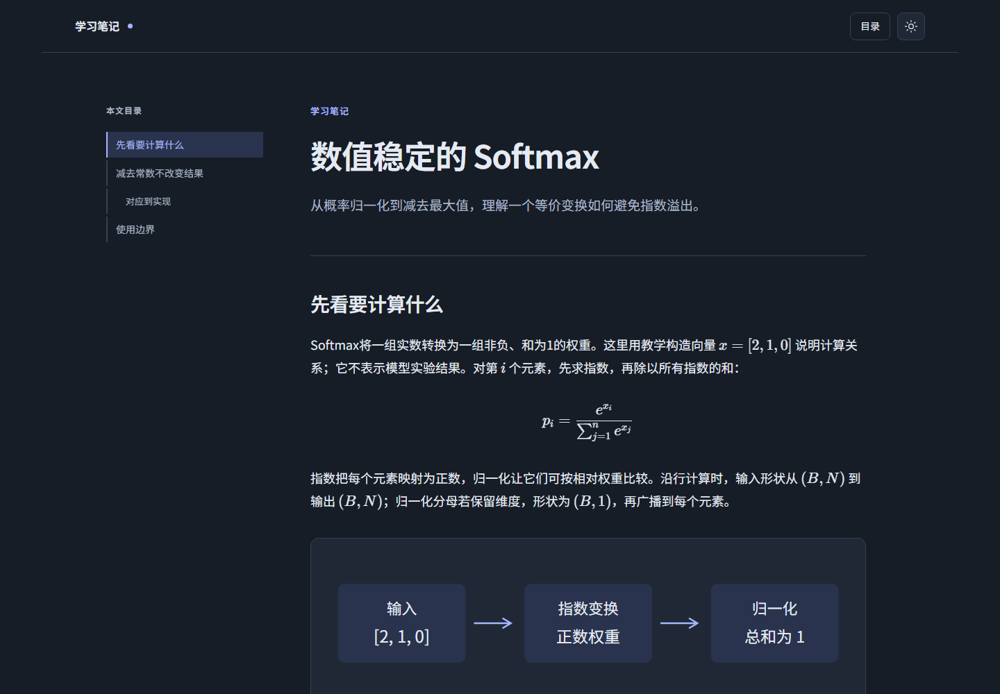
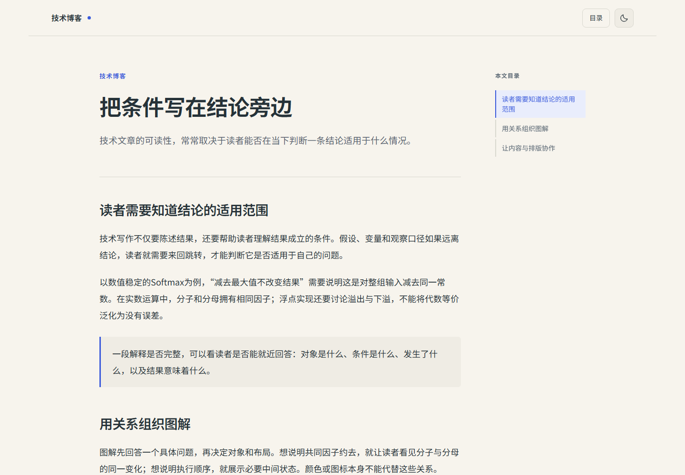
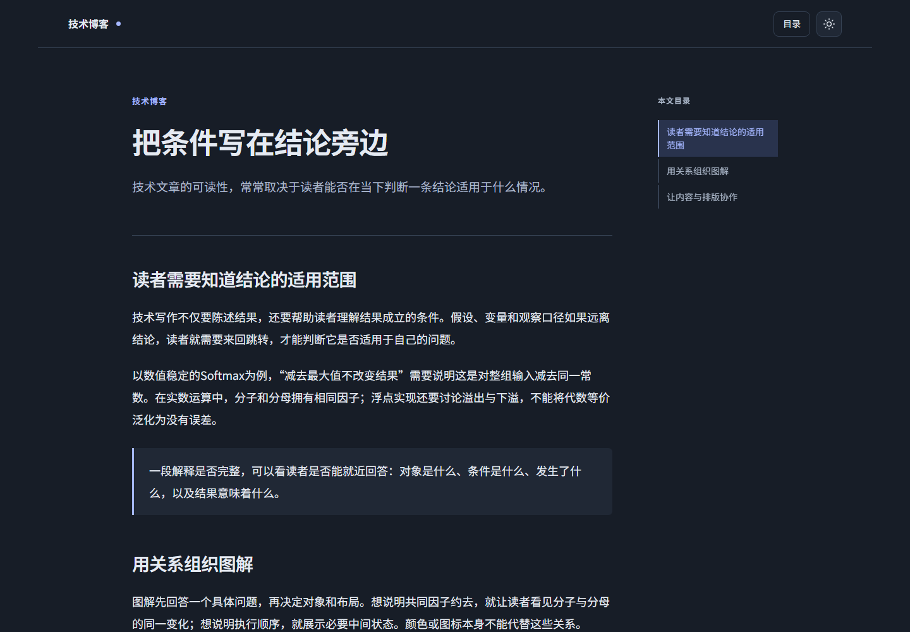
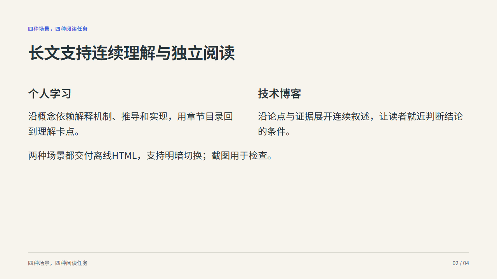
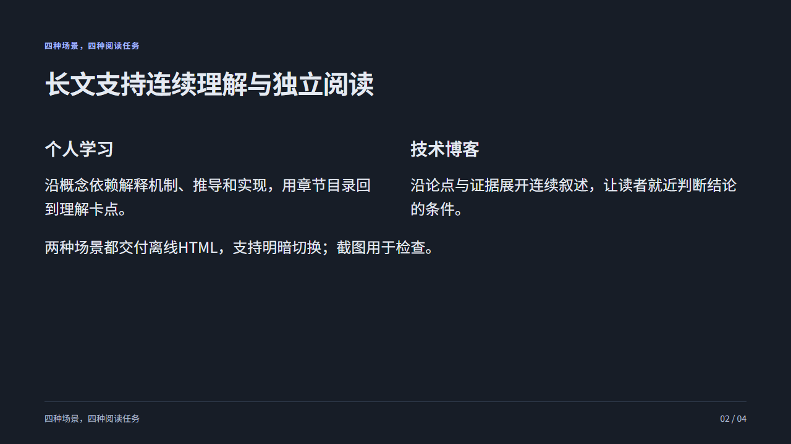

# 四场景示例

这里是可复现的排版与工作流示例。学习、博客和汇报分别策划；小红书继续使用原 `demos/academic.md`，不混入新模板。示例不表示用户实验结果或自动撰稿能力。

| 场景 | 浅色 | 深色 |
|---|---|---|
| [学习稿](learning.md) |  |  |
| [博客稿](blog.md) |  |  |
| [汇报稿](report.md) |  |  |

按根README安装依赖并显式准备中文字体缓存，再从仓库根目录执行：

```bash
python -X utf8 scripts/build_content.py demos/content/learning.md --scene learning --output output/demo-learning/index.html
python -X utf8 scripts/render_content.py output/demo-learning/index.html --scene learning --output-dir output/demo-learning/delivery
```

博客和汇报改为对应文件名与scene。直接离线打开 `index.html`，用目录按钮开合侧栏，太阳/月亮按钮切换主题。汇报可用方向键、Home/End、N备注和目录直达；导出PNG的主题用 `render_content.py --theme light|dark` 指定。
